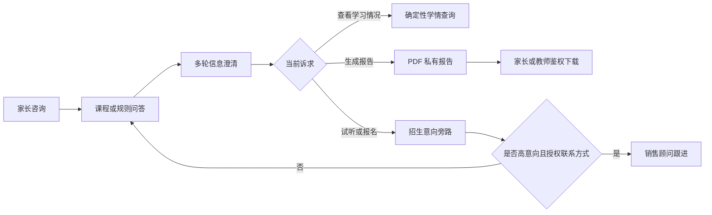
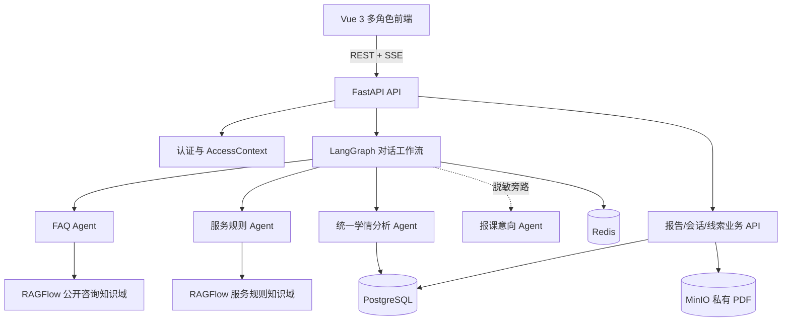
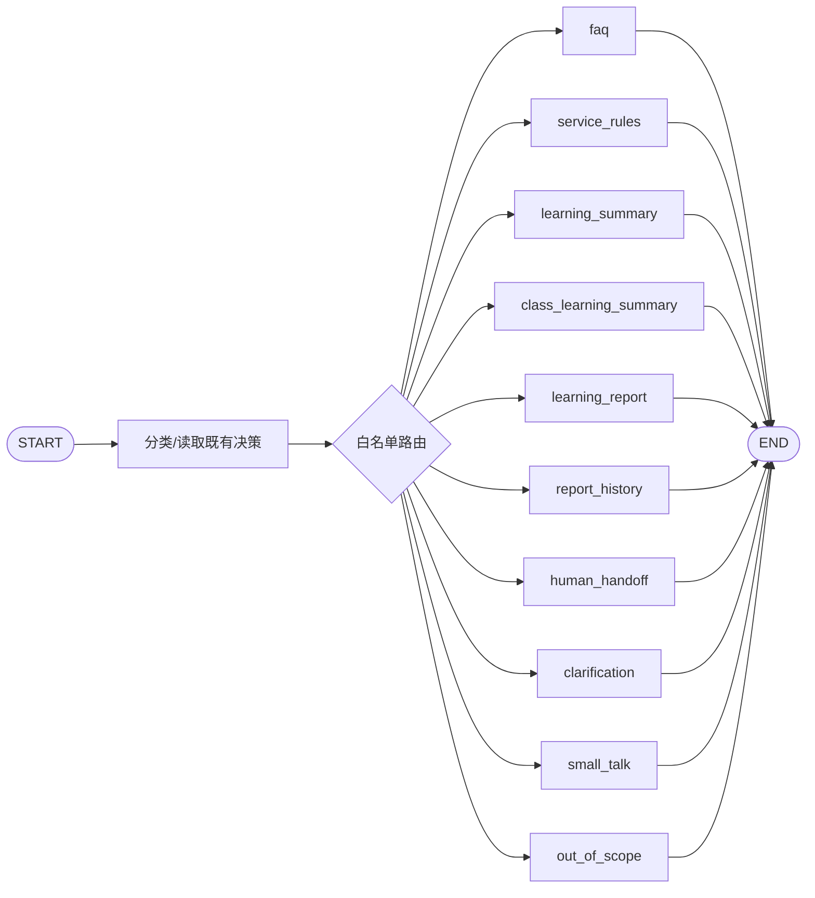
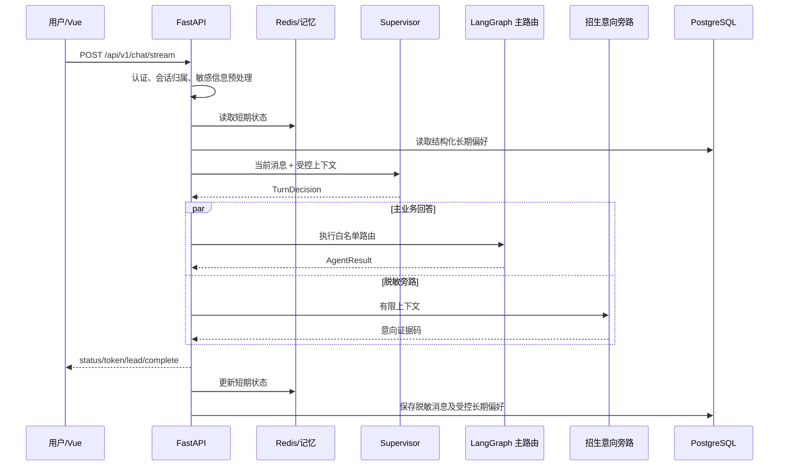
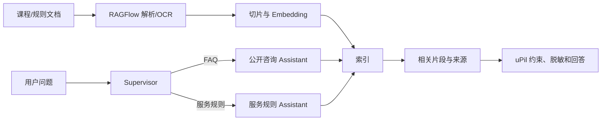
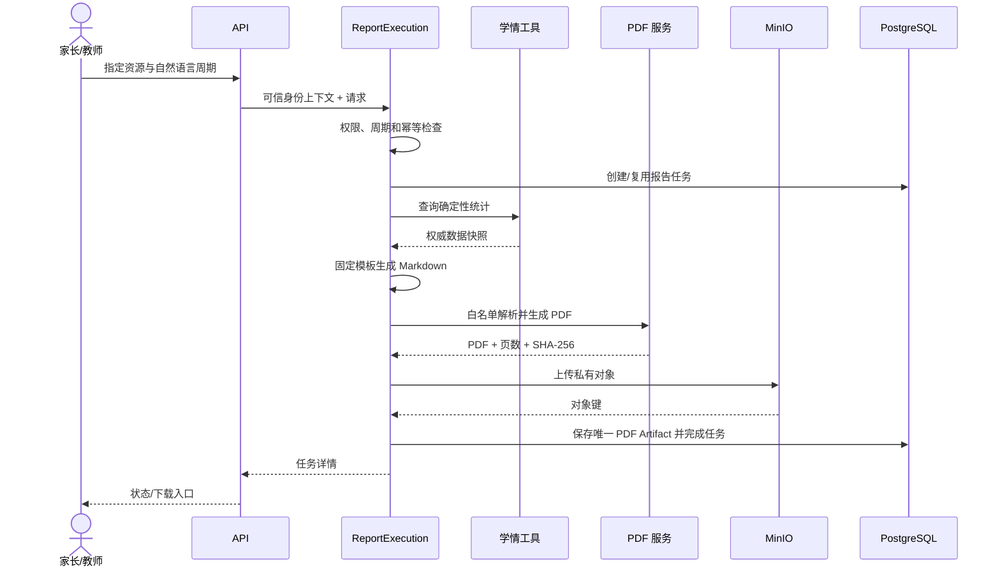
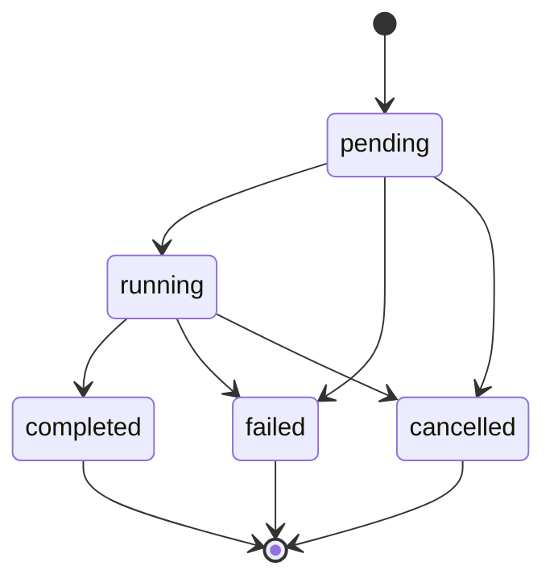
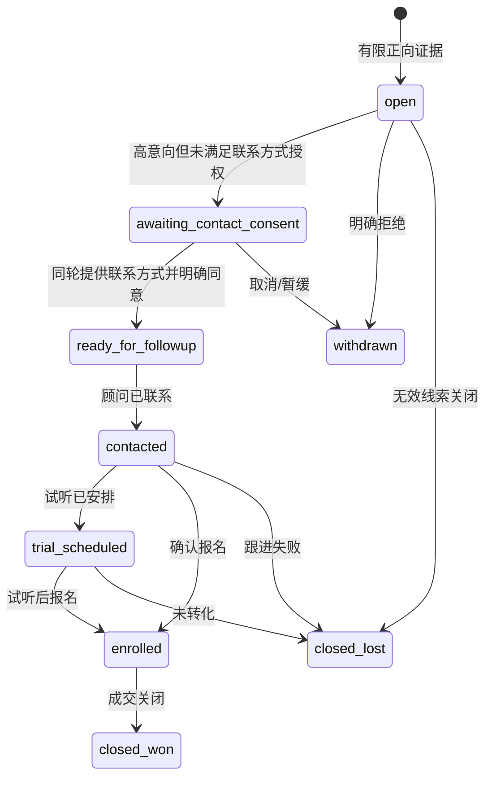
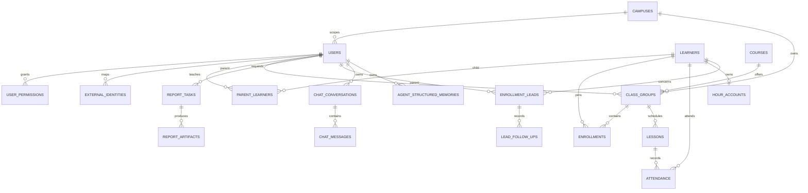

# uPil 项目详细技术文档

> 文档版本：1.0
> 对应代码分支：`main`
> 基线提交：`5c11572 docs: rewrite project README for current architecture`
> 核验日期：2026-09-17
> 项目性质：个人开发、作品展示与求职交流项目

## 文档说明

本文档以 `D:\uPil` 当前源码、配置、数据库模型和测试结果为唯一事实依据，用于说明 uPil 的业务目标、系统架构、Agent 编排、上下文与记忆治理、RAGFlow 检索、学情报告、招生线索、权限安全、前端实现、部署方式和质量保障。

文档中的能力分为三类：

- **当前实现**：代码中已经存在，并由自动化测试或实际配置链路覆盖；
- **部署可选项**：代码已经支持，但需要在本地 `.env` 中启用或接入外部服务；
- **未来增强**：当前没有上线，不能在答辩或项目介绍中描述为已完成。

特别边界：

- 当前运行链路已经移除 A2A/DSH，不依赖远程学情子节点；
- 教师媒体工作台已经下线；
- 情景向量记忆默认关闭；
- 项目没有接入真实机构 IdP、CRM、短信、电话、支付、实时排课或实时名额系统；
- RAGFlow 管理知识检索，不管理 uPil 的身份、学情、报告和线索业务状态；
- MinIO 只保存报告 PDF，不是 RAG 知识原文档入口。

---

# 第一篇 项目与架构

## 1. 项目背景

素质教育机构的家长服务并不是单轮 FAQ。一个真实咨询往往会经历课程了解、年龄与基础补充、班型纠错、请假规则插问、回到原课程、试听意向确认以及联系方式授权等多个阶段。同时，家长、教师和销售顾问所能访问的数据完全不同：

- 家长关心课程是否适合、孩子近期表现和学情报告；
- 教师关心自己授课班级的确定性统计和班级报告；
- 销售顾问只应处理家长明确授权后的试听或报名线索；
- 实时费用、名额和排课不属于静态知识，模型不能自行推断；
- 出勤、课时和报告必须来自数据库，不能依靠大模型“回忆”。

因此，uPil 的核心问题不是“让模型回答更多”，而是建立明确的职责边界：

> 大模型负责语言理解、有限分类、归纳和表达；确定性系统负责身份、权限、业务事实、状态迁移和数据持久化。

## 2. 项目目标

uPil 当前围绕以下目标构建：

1. 提供课程、适龄、装备、校区、活动和服务规则咨询；
2. 支持指代消解、用户纠错、槽位补充、话题切换和话题恢复；
3. 使用 RAGFlow 检索机构文档，并约束回答来源和业务边界；
4. 使用数据库工具计算个人与班级学情，避免模型编造统计值；
5. 完成家长学生报告和教师班级报告的 PDF 私有交付；
6. 在正常问答旁路识别试听、报名和顾问联系意向；
7. 只有在家长主动提供且明确同意时保存联系方式；
8. 通过角色、能力点和资源归属实现多用户数据隔离；
9. 通过 Redis、PostgreSQL 和受控摘要支持连续对话与跨会话偏好；
10. 形成可测试、可诊断、可部署的完整前后端项目。

## 3. 用户角色与业务闭环

### 3.1 家长

家长可以进行课程和规则咨询，查看本人绑定孩子的实时学情，生成、查看和下载学生学情报告，管理自己的聊天会话，以及在明确授权后提交试听或报名联系方式。家长不能读取其他家长的学员、报告、会话或线索，也不能查看班级级聚合统计。

### 3.2 任课教师

任课教师可以查看自己实际授课且位于授权校区内的班级，查询班级确定性学情统计，并生成和下载自己班级的周期报告。教师不能通过修改班级编号读取其他教师的班级，也不会自动获得销售线索权限。

### 3.3 销售顾问老师

销售顾问老师在认证模型中复用 `teacher` 角色，但必须额外具有 `lead_followup` 权限。该能力画像与任课教师互斥：顾问可以查看和领取线索、查看已授权联系方式、记录跟进，但不显示教师班级统计页面，也不因底层角色相同而获得学员或班级数据权限。

### 3.4 业务闭环



## 4. 技术栈与选型

| 层次 | 技术 | 当前用途 |
| --- | --- | --- |
| 后端 | Python 3.11、FastAPI、SQLAlchemy 2.x | REST、SSE、领域服务、数据库访问 |
| Agent | LangChain 1.x、LangGraph 1.x、Pydantic | 模型适配、图编排、结构化输出校验 |
| 前端 | Vue 3、TypeScript、Vite、Vue Router、Pinia | 多角色工作台、路由、状态和 SSE 交互 |
| 业务数据库 | PostgreSQL 16 | 用户、学员、课程、学情、报告、线索、会话与长期偏好 |
| 短期状态 | Redis 7.4 | 最近对话、摘要、确认槽位和 pending flow |
| 对象存储 | MinIO | 私有保存报告 PDF |
| 知识检索 | RAGFlow | 文档解析、切片、Embedding、检索和引用 |
| PDF | markdown-it-py、WeasyPrint、pypdf | Markdown 白名单渲染、PDF 生成与完整性校验 |
| 隐私保护 | cryptography/Fernet、HMAC | 联系方式加密与去重指纹 |
| 认证 | PyJWT、OIDC/JWKS | 可选 OIDC Resource Server |
| 测试 | pytest、Vitest、vue-tsc | 后端、组件、类型和构建检查 |

选择 Vue 而不是 Chainlit 或 Streamlit，是因为项目需要细粒度路由权限、会话侧边栏、报告页面、销售线索工作台和文件下载等产品级界面。Chainlit/Streamlit 更适合快速原型，不适合作为当前多角色业务工作台的长期承载层。

## 5. 系统总体架构

### 5.1 业务视角

```text
                       +----------------------+
用户请求 --安全预处理-> | Supervisor / 仲裁层 |
                       +----------+-----------+
                                  | 主路由
             +--------------------+--------------------+
             |                    |                    |
         FAQ Agent           服务规则 Agent       学情分析 Agent
      公开课程与校区知识       制度与边界规则       数据库、Tool、报告
                                                       |
                                      +----------------+----------------+
                                      |                |                |
                                   个人学情          家长报告        教师班级统计

家长请求 --脱敏文本----------------------------------> 招生意向旁路 Agent
                                                       | 有限证据
                                                       v
                                                确定性线索状态机
                                                       |
                                                       v
                                                销售顾问老师跟进
```

### 5.2 技术视角



这里的“多 Agent”表示职责、上下文投影、数据源和工具权限隔离，不表示每个 Agent 都必须是远程服务。需要复用的学情能力由进程内 Service 和 Tool 统一实现，避免个人学情、家长报告和教师报告各复制一套统计逻辑。

## 6. 项目目录与依赖方向

```text
uPil/
├─ backend/app/
│  ├─ agents/          # Agent 单职责实现
│  ├─ api/             # FastAPI 路由、依赖和 HTTP 边界
│  ├─ configuration/   # 配置审计和弃用项检查
│  ├─ connectors/      # 模型、外部服务边界适配
│  ├─ context/         # ContextEnvelope、投影、结果归并
│  ├─ conversations/   # 会话目录和脱敏消息历史
│  ├─ dialogue/        # 意图、槽位、pending 与状态仲裁
│  ├─ integrations/    # PostgreSQL、Redis、MinIO、RAGFlow 接入
│  ├─ memory/          # 短期会话和结构化长期记忆
│  ├─ observability/   # 脱敏决策日志
│  ├─ prompts/         # Prompt 常量与装配
│  ├─ services/        # 认证、报告、线索等领域服务
│  ├─ tools/           # Agent 可调用的受控业务工具
│  └─ workflows/       # LangGraph 状态、节点、路由和图构建
├─ frontend/           # Vue 3 前端
├─ infra/              # Docker、staging 和 RAGFlow 配置
├─ knowledge_base/     # 知识库源文件与构建资源
├─ scripts/            # 初始化、审计、评测和运维脚本
├─ tests/              # 后端与专项回归测试
└─ docs/               # 方案、日志、验收和面试文档
```

主要依赖方向为：

```text
API / Workflow -> Service / Tool -> Repository / Integration -> Infrastructure
                      ^
Agent / Dialogue -----+
```

图编排层不直接写 HTTP/A2A 请求，不直接拼 SQL；Tool 负责执行受控业务能力，但不决定 LangGraph 路由；Prompt 与状态 Schema 独立于节点。当前最大的生产 Python 文件为 `backend/app/services/conversation_state.py`，共 616 行，没有生产 Python 文件超过 800 行。

---

# 第二篇 Agent 与对话系统

## 7. Agent 职责模型

| Agent/节点 | 核心职责 | 可使用的数据 | 不允许做的事 |
| --- | --- | --- | --- |
| Supervisor | 识别主意图、实体和槽位，仲裁 pending | 当前消息、短期上下文、结构化决策模型 | 直接修改业务数据 |
| FAQ Agent | 课程、适龄、装备、校区、活动咨询 | 公开知识域、受控上下文 | 查询私人学情、编造实时名额 |
| 服务规则 Agent | 请假、调课、补课等制度问题 | 服务规则知识域 | 擅自承诺特殊处理 |
| 统一学情分析 Agent | 个人学情、家长报告、教师班级报告 | 权限校验后的数据库工具 | 直接采用模型生成统计值 |
| 报告历史节点 | 展示当前身份可访问的报告 | PostgreSQL 报告元数据 | 绕过资源归属校验 |
| 人工转接节点 | 实时费用、名额、投诉等边界事项 | 当前会话的最小上下文 | 假装已完成真实预约 |
| 澄清节点 | 追问完成当前任务所缺的必要信息 | 确认槽位、缺失槽位 | 重复询问已确认信息 |
| 闲聊节点 | 问候、感谢、结束语 | 当前消息 | 误触发 FAQ 或线索 |
| 域外节点 | 拒绝与机构业务无关的问题 | 意图结果 | 把域外问题交给知识库猜答 |
| 招生意向 Agent | 旁路提取有限意向证据 | 脱敏消息与受控课程上下文 | 覆盖主回复、直接决定保存联系方式 |

## 8. LangGraph 图结构

对话图位于 `backend/app/workflows/conversation/`。状态契约 `ConversationState` 只传播图执行所需的最小字段，包括消息、身份上下文、决策、路由、实体、报告参数和输出，不保存完整历史、认证 Token 或联系方式。



`RouteName` 使用 `Literal` 白名单限制路由值，避免模型生成任意节点名称。Supervisor 先形成受控 `TurnDecision`，图只消费该决策；缺少计划时才使用保守的确定性路由基线。

## 9. Supervisor 与 TurnDecision

Supervisor 不是一个“万能回答 Agent”。它输出结构化识别结果，随后交给确定性状态机复核。`TurnDecision` 综合以下信息：

- 主意图与旁路次要意图；
- 课程或课程类别实体；
- 用户是否纠正上一轮说法；
- 年龄、编程基础、上课时间、周期等槽位；
- 槽位来源与是否已确认；
- 当前 pending flow；
- 对话行为：提问、补槽、纠错、取消、暂缓、问候等；
- 副作用等级：无副作用、只读、写入、人工复核；
- UNKNOWN 类型和最终白名单路由。

Router 模型可通过 `LLM_ROUTER_MODEL` 单独配置，并固定 `temperature=0`。模型输出经 Pydantic 校验；超时、异常或格式不合法时进入确定性回退，不把模型错误直接暴露给用户。

## 10. 仲裁优先级与 UNKNOWN

当前核心优先级为：

```text
显式取消或安全边界
  > 与当前 pending 兼容的槽位补充
  > 用户明确纠错与本轮主意图
  > 确定性业务守卫
  > 旁路招生意图
  > UNKNOWN 分类
```

这样可以避免常见错误：

- “我再考虑一下，先不用安排”应撤回线索，而不是进入 FAQ；
- “12 岁，没有编程基础”已经确认基础，不应再次追问是否学过 Scratch；
- “我刚才说错了，是编程项目实践班”应覆盖旧课程实体；
- “多少钱，我还想预约试听”需要把实时费用转人工，同时保留试听高意向旁路；
- pending 任务只能消费与其兼容的补槽消息，不能劫持新的无关问题。

`UNKNOWN` 被拆为“需要澄清”“域内一般咨询”“闲聊”和“业务域外”四类，分别进入澄清、FAQ、闲聊或拒绝节点，避免所有未知问题都交给知识库猜答。

## 11. 实体、槽位与确认状态

槽位不是普通字符串，而是带来源和确认状态的结构化值。主要来源包括用户本轮明确提供、确定性解析器提取、已确认会话状态和模型推断。只有用户明确提供、确定性白名单解析或已确认状态可以驱动报告、班级统计等高风险工具；模型推断默认不视为已确认，不得扩大数据库查询范围。

| 意图 | 必要槽位或业务规则 |
| --- | --- |
| 家长报告 | 周期可由自然语言解析；未指定时默认最近 30 天 |
| 教师班级统计/报告 | 已授权 `class_id` 和合法周期 |
| 联系方式保存 | 已存在高意向、有效联系方式、同轮明确授权 |

## 12. 指代消解、纠错、取消与话题恢复

多轮能力由确定性实体规则、短期状态和 Router 共同完成：

- “那个班”优先引用最近已确认的具体课程，而不是任意历史课程；
- “回到刚才的合唱班”显式恢复对应主题；
- “我说错了”把新实体标记为纠错并替换旧实体；
- “算了”“先不用安排”结束与试听/报名相关的 pending 状态；
- 插入请假问题后，原课程实体仍可在后续通过显式恢复继续使用；
- 年龄、基础等已确认槽位不会因普通话题切换被模型随意覆盖。

PostgreSQL 会话快照可在 Redis 缓存为空时恢复，但采用 `only_if_empty`，防止较旧持久快照覆盖并发请求已经写入的更新状态。

## 13. 请求级共享上下文

`ContextEnvelope` 是一次请求内的不可变共享上下文，包含可信 `AccessContext`、请求和会话编号、已脱敏消息、已仲裁决策、当前实体、确认槽位、滚动摘要、最近轮次以及经过权限过滤的长期偏好。

字段可以携带来源、可信等级、作用域、是否可持久化和是否敏感等元信息。Agent 只读 Envelope，不能直接改写身份或权限。Agent 输出统一封装为 `AgentResult`，再由 reducer 按可写字段白名单合并；对未授权字段和重复覆盖记录冲突原因。这让 FAQ 主回答与招生意向旁路可以共享同一份受控决策，又不会互相覆盖路由和身份。

## 14. SSE 流式响应

聊天入口是 `POST /api/v1/chat/stream`，响应使用 `text/event-stream`。

| 事件 | 内容 | 用途 |
| --- | --- | --- |
| `status` | 稳定状态码和用户可见进度 | 显示查询或生成过程 |
| `token` | 回答文本片段 | 渐进式渲染主回答 |
| `lead` | 脱敏线索卡投影 | 仅在授权、保存或撤回需要反馈时展示 |
| `complete` | 路由、提供方、完成状态等安全元数据 | 结束本轮并更新页面状态 |

HTTP 层在发送 SSE 响应头前完成会话归属校验；响应设置禁缓存和禁代理缓冲。服务端使用请求 ID 关联日志，浏览器可从 `X-Request-ID` 获取追踪标识。



---

# 第三篇 上下文、记忆与知识检索

## 15. 记忆分层原则

uPil 不把“记忆”等同于向量数据库，而是按作用域和事实稳定性分层：

| 层次 | 内容 | 存储位置 | 生命周期 |
| --- | --- | --- | --- |
| 请求工作上下文 | 身份、当前消息、决策、工具结果引用 | 进程内 ContextEnvelope/LangGraph State | 单次请求 |
| 短期会话记忆 | 最近轮次、摘要、确认槽位、pending | Redis | 默认 30 分钟 TTL，可恢复 |
| 持久会话历史 | 会话目录、脱敏消息、上下文快照 | PostgreSQL | 用户删除或治理清理前 |
| 结构化长期记忆 | 低敏感稳定偏好 | PostgreSQL | 跨会话，支持状态和版本 |
| 程序性记忆 | SOP、权限规则、Prompt、Tool 契约 | Git 管理的代码与配置 | 随版本发布 |
| 情景向量记忆 | 历史事件语义召回 | 当前未启用 | 未来评测后决定 |

动态课时、出勤、报告状态、实时名额和费用不是记忆，必须每次重新查询权威数据源。

## 16. Redis 短期会话记忆

`ConversationMemory` 只允许保存当前课程实体、孩子年龄、编程基础、上课时间偏好、pending 意图、滚动摘要、最近脱敏轮次、版本号和更新时间。

Redis Key 由应用命名空间以及可信 `tenant_id + user_id + role + conversation_id` 共同构造，避免仅凭前端会话编号发生串读。更新使用 Redis 分布式锁，在同一主体同一会话内执行“读取—处理—写回”；数据键有 TTL，锁键使用独立短租约。

Redis 不保存认证 Token、联系方式明文、完整数据库查询结果、知识库正文、MinIO 密钥或模型思维链。uPil 使用独立 `upil-redis`，不复用 RAGFlow 内部 Valkey/Redis。

## 17. PostgreSQL 会话历史

`chat_conversations` 保存会话所有权、标题、受控上下文快照和最后消息时间；`chat_messages` 保存按序号排列的用户/助手脱敏文本。系统支持新建、列出、继续、重命名和删除会话，也支持 Redis 状态丢失后从白名单快照恢复。

持久消息不保存 Prompt、工具原始返回、模型内部推理、联系方式明文或任意 Agent 对象。会话查询始终同时校验租户、用户和角色。

## 18. 结构化长期记忆

当前长期记忆只开放三个白名单类型：

| 类型 | 示例 | 使用方式 |
| --- | --- | --- |
| `course_interest` | 孩子喜欢编程 | 新会话选课咨询时作为偏好上下文 |
| `class_time_preference` | 周末上午方便 | 辅助表达时间偏好，但不等于实时班次 |
| `child_nickname` | 孩子小名叫果果 | 后续会话自然称呼或回忆 |

记忆作用域由 `tenant_id + owner_user_id + owner_role + learner_id(可选)` 组成。显式“请记住”优先触发写入；自动判断只接受低敏感、稳定且有长期价值的白名单事实；敏感信息和动态事实直接拒绝。写入使用规范化 key/value，更新保留版本和来源会话，Agent 只读取 `{key, value}` 投影。

`MEMORY_WRITE_ENABLED=true` 控制写入。同一可信用户更换 `conversation_id` 后可以继承偏好，但不同用户、角色、租户或学员作用域不会共享。

## 19. 上下文压缩与 Token 预算

长对话采用“结构化槽位 + 最近原始轮次 + 历史滚动摘要”，而不是把全部消息塞入 Prompt。默认配置为：

- `CONVERSATION_RECENT_TURNS=8`；
- `CONVERSATION_SUMMARY_TOKEN_BUDGET=300`；
- `CONVERSATION_CONTEXT_TOKEN_BUDGET=1200`；
- `CONVERSATION_TTL_SECONDS=1800`。

已确认槽位独立保存，不能只存在于自然语言摘要；最近轮次保留原文以支持局部指代；较早内容进入摘要；动态学情不由摘要承载；摘要和轮次均经过长度限制与脱敏。

## 20. 为什么情景向量记忆默认关闭

`EPISODIC_MEMORY_ENABLED=false` 是有意的工程边界。当前关键跨会话信息数量少、类型明确，使用结构化 PostgreSQL 记录比向量召回更精确、可解释和易删除。

直接把全部聊天向量化会带来闲聊污染、纠错后旧片段继续召回、敏感信息治理、namespace 串读和缺少阈值评测等问题。未来只有在“需要回忆无法结构化的历史事件”成为明确需求后，才应先完成写入准入、向量模型评测、混合评分、冲突失效、删除回滚和隔离测试，再启用情景记忆。

## 21. RAGFlow 知识检索链路

RAGFlow 负责 PDF/Markdown/图片/表格解析、OCR、切片、Embedding、混合检索和来源引用；uPil 负责知识域路由、查询改写、身份权限、低置信度处理、结构化工具、敏感信息过滤和 SSE。



公开 FAQ 与服务规则使用两个独立 Chat Assistant，减少知识域污染。RAGFlow 不能替代数据库学情工具，也不能确认实时名额、费用和排课。

选择 RAGFlow 并不等于缺少技术含量。向量数据库只负责向量存储和近邻查询，自研完整 RAG 还需承担解析、OCR、表格处理、切片、Embedding 重建、混合检索、引用映射、版本管理和诊断。项目复用成熟知识基础设施，将工程重点放在多轮仲裁、确定性学情、权限、报告、记忆和招生闭环；通过 Adapter 和知识域路由保留替换空间。

RAGFlow 不可用时，系统返回固定安全提示，不伪造答案。普通健康检查仅探测依赖，深度健康检查显式验证检索和 Embedding 完整链路，诊断响应不会泄露 API Key、Chat ID、知识正文或模型名称。

---

# 第四篇 确定性业务闭环

## 22. 个人学情工具

个人学情查询不是 FAQ，也不是从历史对话中推测答案。`backend/app/tools/class_learning_tools.py` 从 PostgreSQL 读取学员、报名、课次、考勤和课时账户，并返回受控的结构化结果。调用前由服务层确认当前家长是否绑定该学员，模型只能看到授权后的字段投影。

个人学情主要包含：

- 学员当前有效报名和课程；
- 查询周期内的计划课次；
- 已出席、缺勤、请假和未登记考勤数量；
- 出勤率以及数据完整性提示；
- 剩余课时和低课时提醒；
- 缺失课时账户等异常状态。

个人出勤率以已有明确考勤记录为分母：

```text
marked_lessons   = present + absent + leave + excused
attendance_rate  = present / marked_lessons
```

`leave` 与 `excused` 在家长可读结果中统一归为请假；未知状态不被误算为缺勤，而是进入未登记或数据异常提示。分母为零时不伪造百分比，返回“暂无可计算考勤”。

个人学情 Agent 负责解释数据，例如指出“本周期有两次缺勤，需要关注出勤稳定性”；但人数、次数、比率和余额全部来自工具结果，Prompt 不允许模型改写权威数值。

## 23. 教师班级统计与计算口径

教师班级统计同样由 `class_learning_tools.py` 确定性计算。访问前需要同时满足：当前用户是教师、班级属于授权校区、教师与班级存在实际授课关系，并且统计只覆盖有效报名学员。

核心指标定义如下：

| 指标 | 计算方式 | 说明 |
| --- | --- | --- |
| 有效学员人数 | 周期内有效报名学员去重计数 | 不包含无效或不在统计周期内的报名 |
| 计划课次 | 周期内班级计划课次计数 | 由数据库课次决定 |
| 应有考勤记录 | 计划课次 × 有效学员人数 | 记为 `expected_records` |
| 班级完课率 | 已有出勤记录数 / 应有考勤记录数 | 反映课次和考勤完成程度 |
| 班级出勤率 | 出席记录数 / 已登记考勤记录数 | 未登记记录不进入分母 |
| 学员完课率 | 学员已有考勤课次 / 学员计划课次 | 用于个体层面排查 |
| 学员出勤率 | 学员出席课次 / 学员已登记课次 | 区分缺勤和未登记 |
| 缺勤 TOP5 | 缺勤次数降序、学员编号升序 | 稳定排序，最多五名 |
| 低课时学员 | `remaining_hours <= low_balance_threshold` | 阈值来自配置或业务规则 |
| 未登记考勤 | 应有记录减已有有效考勤记录 | 不直接归为缺勤 |
| 缺失课时账户 | 有有效报名但没有课时账户 | 单独展示数据异常 |

已知考勤状态为 `present`、`absent`、`leave` 和 `excused`。未知状态被计入数据质量问题，不参与出勤率分子，也不被错误归类为缺勤。

这种设计把“计算”与“表达”分离：数据库和 Python 服务产生唯一统计结果，LLM 只负责归纳班级表现、解释异常指标并形成教师可读建议。因此接口结果、页面数字和 PDF 中的统计值可以使用同一份快照校验。

## 24. 家长和教师报告闭环

家长报告和教师班级报告复用统一执行入口 `backend/app/services/report_execution.py`，但权限校验、数据查询和模板不同。

家长报告链路：

1. 读取可信家长身份；
2. 校验 `parent_learners` 绑定关系；
3. 解析自然语言周期；
4. 计算该学员的确定性学情快照；
5. 使用家长报告固定模板生成内容；
6. 生成并校验 PDF；
7. 保存私有产物和任务元数据；
8. 家长通过列表、详情或聊天查看状态并下载。

教师报告链路：

1. 读取可信教师身份；
2. 校验教师、校区、班级和授课关系；
3. 解析自然语言周期；
4. 计算班级确定性统计；
5. 使用教师报告固定模板生成分析说明；
6. 生成并校验 PDF；
7. 保存私有产物和任务元数据；
8. 教师只能查看和下载自己有权访问的班级报告。

报告周期必须由用户明确指定，支持“上个月”“本月”“最近 30 天”、明确月份和明确起止日期。模糊表达会进入澄清，系统不会静默套用“默认近一个月”。



当前新报告只生成一个 PDF Artifact。Markdown 是进程内中间态，不作为第二份正式产物保存；历史家长 Markdown 或早期双产物记录仅在读取侧兼容。教师报告不生成 CSV。

## 25. Markdown 到 PDF 的安全转换

PDF 转换集中在 `backend/app/services/markdown_pdf.py`。固定模板先生成受控 Markdown，再由 `markdown-it-py` 解析，由 WeasyPrint 渲染，最后使用 `pypdf` 验证结果。

输入边界：

- Markdown 最大 128 KB；
- 禁止原始 HTML，避免脚本、标签注入和任意样式；
- 禁止代码块、图片、链接和 URL；
- 只允许标题、段落、列表、强调和表格等白名单 token；
- 不允许报告正文加载外部网络资源；
- WeasyPrint 只可读取配置允许的本地字体。

输出验证：

- 文件必须以 `%PDF-` 开头；
- 文件大小和页数必须在配置范围内；
- 计算 SHA-256 并与后续上传结果一致；
- 必须包含报告标题和模板版本；
- 必须包含必要的隐私或口径说明；
- 禁止出现数据库内部 ID、Token、密码、API Key、数据库 URL、MinIO/S3 地址和对象密钥；
- 可将本次请求中已知的敏感值加入扫描集合，防止模板或上游内容误写入 PDF。

WeasyPrint 在 Windows 上依赖 Pango/GLib。依赖缺失时报告任务失败并记录安全错误，不回退为未经校验的 HTML、Markdown 或伪 PDF，从而保证“可下载”始终代表已完成相同安全检查。

## 26. MinIO 私有交付

`backend/app/integrations/minio.py` 封装对象存储。默认私有桶为 `upil-reports`，对象键格式为：

```text
reports/{task_id}/{checksum}.pdf
```

上传前再次校验 PDF 魔数、文件大小和 SHA-256。数据库只保存对象键、校验和、下载文件名、媒体类型、文件大小和页数，不保存公开 URL。对象键必须满足固定前缀和字符规则，路径穿越、绝对路径及非法扩展名会被拒绝。

下载采用后端代理：

1. 浏览器请求 `/api/v1/reports/{task_id}/download`；
2. API 根据当前身份重新查询任务；
3. 重新校验家长—学员或教师—班级归属；
4. 服务端按受控对象键从 MinIO 读取文件；
5. 校验媒体类型、长度和必要元数据；
6. 以附件响应返回浏览器。

浏览器不会获得 MinIO Access Key、Secret Key 或永久公开地址。MinIO 仅承载 uPil 生成的报告 PDF；RAGFlow 的原始知识文档、切片和索引由 RAGFlow 自身管理。

## 27. 报告状态机、幂等和失败补偿

报告任务状态包括：

- `pending`：任务已创建，尚未开始；
- `running`：正在统计或生成 PDF；
- `completed`：唯一 PDF Artifact 已验证并持久化；
- `failed`：执行失败，保存安全错误摘要；
- `cancelled`：任务被取消。



三种终态不可逆，避免失败任务被原地改写后失去审计语义。安全重新生成会创建新的尝试任务，例如在原业务键后增加 `_a2`，不会“复活”旧任务。

幂等键综合以下维度：

- 请求人；
- 报告类型；
- 学员或班级；
- 统计开始与结束日期；
- 模板版本。

相同幂等维度已有 `pending`、`running` 或有效 `completed` 任务时复用已有任务，避免重复统计、重复 PDF 转换和重复上传。失败任务允许创建下一次尝试。

完成动作以数据库记录为准。若 PDF 上传 MinIO 成功但随后数据库事务失败，服务会尽力删除刚上传的对象；若删除也失败，则由日志和对象生命周期治理处理孤儿对象，但不会向用户返回成功状态。数据库中只有在任务和 Artifact 一致提交后，下载入口才可见。

## 28. 招生线索状态机

招生意向分析是主对话的旁路能力。FAQ、服务规则或学情 Agent 先完成用户当前问题；旁路只接收脱敏、裁剪后的有限上下文，并输出证据码，不直接决定最终强度、状态或回复。

证据大致分为：

| 证据级别 | 示例 | 系统处理 |
| --- | --- | --- |
| 高意向 | 明确预约试听、明确报名、要求顾问联系 | 进入授权与联系方式收集流程 |
| 中意向 | 对课程表达正向兴趣、询问试听流程 | 保存开放线索或继续自然咨询 |
| 低意向 | 仅请求更多课程信息 | 不打断主回答 |
| 明确拒绝 | “暂时不用联系”“我再考虑一下” | 撤回 pending，拒绝优先 |

强度和状态由确定性规则根据证据组合计算，避免模型把普通询价、否定表达或“只是了解”误判成高意向。主要状态如下：



实现还保留 `contacted`、`trial_scheduled`、`enrolled`、`closed_won`、`closed_lost` 和 `withdrawn` 等明确业务状态，使页面展示和审计不依赖自由文本推断。

## 29. 联系方式保护与顾问跟进

联系方式写入必须同时满足：

1. 当前存在明确的高意向业务语境；
2. 用户在同一轮主动提供手机号或邮箱；
3. 用户在同一轮明确同意由销售顾问老师联系。

只有手机号、只有“我同意”或从历史闲聊中发现联系方式，都不会保存。联系方式在进入模型、RAGFlow、普通日志和会话消息持久层之前被替换为掩码。

数据库保存三种派生数据：

- Fernet 密文：授权顾问临时解密联系时使用；
- HMAC 指纹：用于幂等和重复联系方式判断，不可反解；
- 掩码：用于列表展示，例如 `155****5555`。

销售顾问老师在数据模型中仍是 `teacher` 角色，但必须具有 `lead_followup` 权限。顾问需要先领取线索，之后才能调用专用接口短暂读取已授权联系方式；每次揭示都写入审计日志。普通教师不能读取联系方式，销售顾问也不能访问班级统计和教师报告。

跟进动作采用结构化事件：

| 动作 | 允许结果 |
| --- | --- |
| `claim` | `claimed` |
| `contact` | `reached`、`unreachable`、`declined` |
| `schedule_trial` | `scheduled`、`cancelled` |
| `confirm_enrollment` | `enrolled` |
| `close` | `won`、`lost` |

当前项目没有接入 CRM、电话、短信、支付或运营转化漏斗。销售工作台承担线索领取、授权联系方式查看和跟进状态回写，是当前范围内的闭环终点。

## 30. 会话目录管理

前端侧边栏的会话目录由 PostgreSQL 持久化，不依赖浏览器本地缓存。当前支持：

- 新建会话；
- 按最近活跃时间列出当前用户会话；
- 切换并继续历史会话；
- 重命名会话；
- 删除会话；
- 加载脱敏消息；
- Redis 短期状态丢失后从受控快照恢复。

会话所有 API 都使用可信 `tenant_id + user_id + role` 查询所有权，不能仅凭 `conversation_id` 读取。删除会话时会清理其持久消息和对应短期 Redis 状态；结构化长期偏好拥有独立生命周期，不会因为删除单个会话自动丢失。

会话消息只用于用户可见历史和多轮上下文恢复。模型内部推理、原始工具结果、认证信息和联系方式明文不进入会话库。标题可以由首轮内容产生，也允许用户后续重命名。

---

# 第五篇 数据、安全与前端

## 31. 核心数据模型

uPil 使用 PostgreSQL 保存需要持久化、可约束和可审计的业务事实。Redis 只保存带 TTL 的短期会话状态，MinIO 只保存报告 PDF 二进制，RAGFlow 则维护自身的知识库数据；这些存储不能互相替代。

核心数据可以分为六组：

| 领域 | 主要数据表 | 职责 |
| --- | --- | --- |
| 身份与授权 | `users`、`user_permissions`、`external_identities`、`campuses` | 保存本地业务身份、细粒度权限、OIDC 映射和教师校区范围 |
| 教学业务 | `learners`、`parent_learners`、`courses`、`class_groups`、`enrollments` | 建立家长、学员、课程、班级和教师之间的资源归属 |
| 学情事实 | `lessons`、`attendance`、`hour_accounts` | 保存计划课次、出勤记录和课时账户，作为确定性统计来源 |
| 报告 | `report_tasks`、`report_artifacts` | 跟踪报告任务状态和最终 PDF 元数据 |
| 招生线索 | `enrollment_leads`、`lead_follow_ups`、`audit_logs` | 保存线索状态、只追加跟进记录和关键操作审计 |
| 会话与记忆 | `chat_conversations`、`chat_messages`、`agent_structured_memories` | 保存会话目录、脱敏消息和跨会话结构化偏好 |

`users.role` 当前只允许业务层使用 `parent` 和 `teacher`。销售顾问不是第三种角色，而是拥有 `lead_followup` 权限的教师账号。这样可以避免为了单一能力继续扩张角色枚举，同时仍由后端能力判断限制接口。

报告采用“任务与产物分离”设计：`report_tasks` 保存请求者、报告类型、业务范围、确定性指标、模板版本和状态；`report_artifacts` 只保存对象键、校验和、媒体类型、文件名、大小和页数。历史记录仍允许 `content` 保存早期 Markdown，但当前新任务只创建 PDF 产物，Markdown 不落库。

## 32. 数据表职责和关系

下图省略了时间戳、状态约束和索引，仅展示主要关系：



关键约束包括：

- `parent_learners` 以家长和学员组成联合主键，防止重复绑定；
- `enrollments` 对班级和学员建立唯一约束，统计时只使用有效报名；
- `attendance` 对课次和学员建立唯一约束，避免同一课次重复考勤；
- 未关闭线索使用规范化幂等键和部分唯一索引，避免并发重复创建；
- `chat_messages` 按会话和顺序号唯一，保持消息顺序稳定；
- 长期记忆的 `scope_key` 包含租户、用户、角色、学员和字段，任一范围内只允许一条活动版本；
- 报告下载不会仅凭 `requester_id` 放行，每次还会重新校验当前家长绑定或教师授课关系。

外键和唯一约束负责数据结构完整性，服务层负责角色、资源和状态迁移等业务约束。两者结合后，模型输出不能直接越过领域服务写入任意状态。

## 33. 认证模式

系统支持三种显式认证模式：

| 模式 | 用途 | 身份来源 | 安全边界 |
| --- | --- | --- | --- |
| `demo` | 本地开发和作品演示 | 页面选择数据库中已有的演示用户 | 不允许用于生产环境 |
| `trusted_headers` | 由可信反向代理完成登录 | 代理注入用户、角色和共享密钥 Header | API 验证代理密钥并回查本地用户 |
| `oidc_jwt` | 直接验证 OIDC Bearer Token | JWT 签名、发行方、受众和主体声明 | `sub` 通过映射表绑定本地用户 |

在 `demo` 模式下，`actor_role` 和 `actor_user_id` 只用于选择已有演示身份。切换到 `trusted_headers` 或 `oidc_jwt` 后，认证服务会忽略这些客户端身份字段，避免用户通过修改查询参数冒充其他账号。

OIDC 只负责证明“外部主体是谁”，不会直接采用 Token 中的角色或校区声明。系统根据 `issuer + subject` 查询 `external_identities`，再回查本地 `users`、`user_permissions` 和校区信息决定授权。这样外部身份提供方与本地业务权限保持解耦，也可以单独停用某一条外部身份映射。

生产配置存在失败关闭规则：禁止 `AUTH_MODE=demo`；OIDC 必须配置发行方、受众和 JWKS，并只允许受支持的非对称签名算法；可信 Header 模式必须使用足够强的代理共享密钥。当前仓库实现了这三种认证接入方式，但没有附带或宣称已经部署真实机构 IdP。
